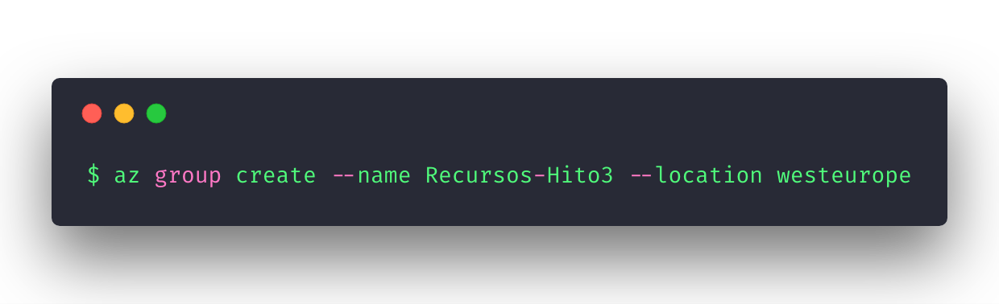
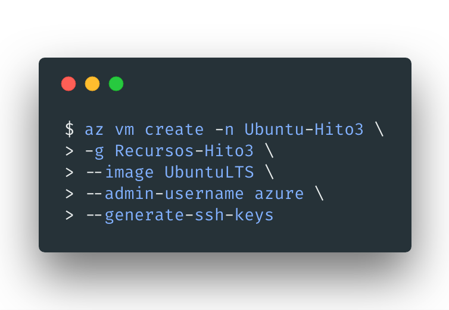
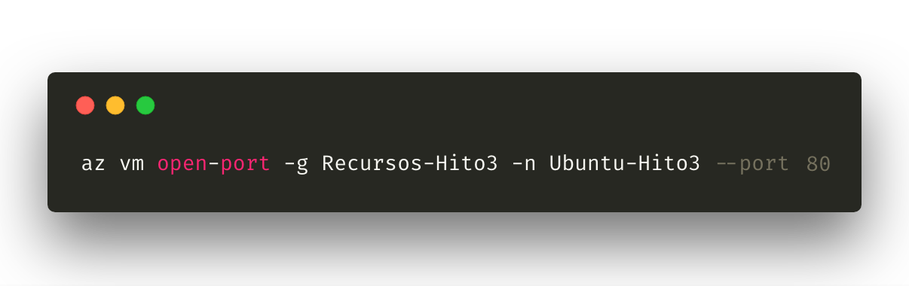

# **[WIP]** ***devtionary*** - *El diccionario por y para desarrolladores*


[](https://travis-ci.com/adrianmorente/devtionary)
[](https://coveralls.io/github/adrianmorente/devtionary?branch=master)


---

## ¿Qué es ***devtionary***? :boom:

Se trata de un servicio web que permite a los desarrolladores de software disponer de una plataforma fiable y multiplataforma sobre la que tomar notas y apuntes relacionados con los proyectos que tengan en desarrollo.

Puede entenderse como un diccionario casero donde es el propio usuario quien define las claves que han de clasificarse, junto con el significado más representativo para el mismo.

#### Espera, ¿otra aplicación de notas... :neutral_face:?

Lejos de ser una fuente de información absoluta, está pensada para funcionar como cualquier aplicación de toma de notas ya conocida pero con algunas distinciones importantes:

- Es el propio usuario quien define **qué información es importante**. Si actualmente se encuentra trabajando en un proyecto para el que ha necesitado consultar información en diversos medios (páginas web, libros, etc.) seguro que precisará de alguna plataforma donde alojar esas anotaciones que personalmente le ayudan a entender la tecnología que está utilizando. Además, si deja de utilizar dicha tecnología y en un futuro necesita volver a ella, tendrá disponibles esos apuntes con las bondades y desventajas que consideró en su momento.

- Una aplicación de notas corriente suele usarse para recordar tareas con estado (*finalizado/no finalizado*) y quizás con fechas de terminación, como las aplicaciones [***Tasks*** y ***Keep*** de ***Google***.](https://keep.google.com/). Sin embargo, no suelen tener un mecanismo intuitivo y cómodo de almacenar **información permanente**, con posibilidad de **ordenación** del contenido (por nombre de la clave, fecha de adición, etc.) y **filtrado según categorías**. ***Devtionary*** está pensada para poner solución a esto.

- Para utilizar esta herramienta no necesitas iniciar sesión en una página web que desconocías hasta ahora; bastará con que uses los servicios con los que estás acostumbrado a trabajar y autenticarte con ellos, gracias al uso de [***Auth0***](https://auth0.com/).

### Implementación y despliegue :rocket:

##### Lenguaje utilizado

- Desde el punto de vista de las **arquitecturas de microservicios**, aprovecharemos las bondades de la *programación políglota* (con los distintos componentes en diferentes lenguajes) para implementar este servicio con el lenguaje **`Node`** (basado en `JavaScript`), dado que ya he trabajado con él y me permitirá centrarme en los contenidos de la asignatura de *Cloud Computing* sin perder tanto tiempo en aprender otras cosas paralelas. En un futuro, la interfaz de usuario abastecida por este usuario podría programarse perfectamente en cualquier otro lenguaje como *JavaScript* y derivados.

- Una vez elegido el lenguaje de programación, agradeceremos el uso de algún *framework* web que nos ayude en la implementación de este tipo de servicios. Dada la sencillez de uso que comporta y el amplio rango de usuarios que posee, utilizaremos [***Express***](https://expressjs.com/es/).

##### Persistencia de datos

- En cuanto al almacenamiento persistente de datos, preferentemente optaremos por una base de datos de tipo no-relacional (*NoSQL*), cuya estructura es más conveniente para proyectos donde la estructura no es definitiva al 100% o las relaciones no llegan a estar perfectamente definidas dada la posibilidad de cambios en los modelos. Para este proyecto, por facilidad de uso y por experiencia con la herramienta, usaremos [***MongoDB***](https://www.mongodb.com/).

Gracias al uso de `Node` acompañado del gestor ***`NPM`*** dispondremos de un módulo llamado también `MongoDB` que nos permitirá interactuar con la base de datos de forma sencilla y directa (como vemos en [este enlace](https://www.w3schools.com/nodejs/nodejs_mongodb_create_db.asp)).

### Integración continua y *testing*

- Como todo sistema software moderno, el código habrá de ser testeado y superará un mecanismo de integración continua antes de aceptar nueva inclusión de código en el repositorio. Esta integración podrá hacerse con herramientas como [***Travis-CI***](https://travis-ci.com).

- Las herramientas software que utilizaremos para realizar dichos tests serán [*Mocha*](https://mochajs.org/) e [*Istanbul*](https://istanbul.js.org/). La primera será la que ejecute los tests al código mientras que la segunda nos mostrará un informe de cobertura cuando termine la primera (esto es, porcentajes de funciones, rutinas y líneas de código cubiertas por los tests escritos).

- Por otro lado, para mejorar la calidad del software (así como el aspecto de nuestro repositorio, por qué no) utilizaremos otra herramienta de control de cobertura de los tests: [*Coveralls*](https://coveralls.io/). Esta se diferencia de *Istanbul* en cuanto a que en lugar de mostrar el informe de cobertura en la terminal del desarrollador, genera datos preparados para ser mostrados desde la web del repositorio; habilitando también una *badge* con el porcentaje para ser enseñado en la descripción de dicho repo.

##### Configuración de los tests en Travis correctamente

La bondad que nos aporta la integración continua, como ya hemos comentado, es el testeo automático de nuestro código de forma previa a su incorporación en el repositorio. Por su parte, Travis, además de funcionar bien y proveer al usuario de un *feedback* en tiempo real de los resultados obtenidos, brilla por su facilidad de configuración:

- Para empezar, basta con registrarse en Travis, conectarlo con GitHub y seleccionar los repositorios que se desean sincronizar.
- A continuación, de forma particular a cada proyecto, es necesaria una pequeña configuración para determinar el lenguaje a contemplar por Travis. Afortunadamente, en la documentación proveen de templates para los lenguajes más comúnmente usados (como lo es en mi caso con NodeJS).

```yaml
language: node_js
node_js:
  - "node"
  - "lts/*"
after_success: 'npm run coveralls'
```

En este fichero `.travis.yml` se lista el lenguaje utilizado, las versiones (en mi caso, `node` para la última y `lts/*` para la última versión de *Long-Term Support*).

Para complementar, podemos monitorizar el porcentaje de cobertura de tests del que dispone nuestro código usando la ya mencionada herramienta ***Coveralls***. Con la última línea del fichero decimos a Travis que una vez se hayan superado con éxito los tests de integración, se ejecute dicha herramienta para calcular el porcentaje de cobertura y orientarnos sobre el volumen de "robustez" de nuestro código (así como mostrarlo en una bonita *badge* en el repositorio).

## Configuración de despliegue

En cuanto a las distintas plataformas de despliegue existentes en la actualidad, podríamos optar por utilizar *Zeit.co* (cuya [nueva versión](https://zeit.co/blog/now-2) merece una mención especial), *Firebase*, *Google App Engine* y/o similares. Sin embargo, utilizaremos [***Heroku***](https://www.heroku.com/) por cercanía, su facilidad de uso y por la definición automática y gratuita de un nombre de dominio estático para la instancia (a diferencia de *Zeit.co*, que genera una nueva URL con cada `push`).

#### Despliegue automático desde GitHub

Uno de los *shortcuts* que nos ahorrará tiempo como *DevOps* en nuestro trabajo, es el despliegue automático del servicio web al hacer `push` al repositorio donde almacenamos y versionamos el código.

De este modo, al hacer `push`, el código sería testeado de forma automática antes de su incorporación al repositorio; en caso positivo, el servicio con las nuevas características añadidas sería desplegado en la nube de forma automática.

Para configurar este despliegue desde *Heroku*, basta con entrar a la pestaña **"Deploy"** del *dashboard* de nuestro perfil registrado, y pulsar el botón **"Enable Automatic Deploys"**. Una vez hecho esto, quedará de la siguiente forma:

Despliegue: https://devtionary.herokuapp.com

## Provisionamiento

Como sabemos, consiste en hacer lo necesario para que nuestro microservicio pueda ejecutarse en una o más instancias de servidores web (generalmente, en forma de máquinas virtuales sobre cualquier plataforma cloud como *Azure*, *AWS* u *OpenStack*). Para llegar a esto, en la máquina final deberán cumplirse diversos factores:

1. Deberá disponer de un sistema operativo apto para la utilidad que buscamos. Para esto nos bastará con instalar alguna de las distribuciones *GNU/Linux* más comunes para este fin.
1. Deberá estar ***git*** instalado en dicho sistema operativo (a través del gestor de paquetes, generalmente *apt* o *yum*), ya que gran parte de los programas pueden ser instalados a partir de ahí; además de que será la herramienta necesaria para clonar el repositorio con el código que se ha de desplegar.
1. Las dependencias del microservicio (dictadas por el lenguaje de programación utilizado) deberán ser instaladas en la máquina. Por ejemplo, para un servicio web programado con *NodeJS*, será de imperativa necesidad disponer de *NPM* así como de las dependencias estipuladas por el `package.json` proporcionado por el proyecto; o por el fichero `requirements.txt` en caso de utilizar *Python* como lenguaje de programación.
1. Finalmente, **el código** del servicio que se desea desplegar (clonado mediante *git* y con sus dependencias instaladas con herramientas similares a las antes mencionadas).

---

##### Sistema operativo

Dentro del catálogo de sistemas operativos disponibles para servidores web nos encontramos con *Debian*, *CentOS* y *Ubuntu Server* principalmente (aunque existen otros).

##### Provisionando con Ansible

Una **herramienta de provisionamiento** como *Rex*, *Puppet* o *Ansible* (entre otras) se encargará de satisfacer los requisitos enumerados en cada una de las instancias que deseemos. En este caso, utilizaremos [`Ansible`](https://www.ansible.com/) por las siguientes razones:

- Al ser una herramienta más moderna que sus "rivales", intenta proveer una interfaz de provisionamiento y orquestación más sencilla que el resto, con las ventajas que ello comporta al desarrollador; aliviando la dificultad de esta parte del desarrollo.
- Está programada en *Python* y depende de dicho lenguaje, que por suerte a día de hoy ya viene instalado en prácticamente cualquier sistema operativo moderno.
- La instalación y primera ejecución son sencillas; y dispone de una documentación rica con secciones dedicadas para las principales plataformas cloud.

##### Desplegando en Azure

Además de la herramienta de provisionamiento que vamos a usar, necesitamos saber **dónde vamos a desplegar el servicio**, que será sobre *Azure* en una instancia de las obtenidas de forma gratuita a través de la Universidad. Este es uno de los principales motivos por los que elegimos la plataforma de *Microsoft*, dado que a pesar de intentar obtener otra instancia gratuita en *AWS* de *Amazon*, por demoras del servicio no ha sido posible.

Para empezar, habremos de instalar de forma local en nuestro ordenador el cliente de línea de comandos de Azure, para evitarnos lidiar con la interfaz web y ser más productivos en la tarea de crear y gestionar recursos. Para ello, podemos seguir la guía [provista por Microsoft](https://docs.microsoft.com/es-es/cli/azure/?view=azure-cli-latest), que nos brindará los pasos sencillos para instalar el cliente (generalmente desde los repositorios de nuestro sistema operativo) y nos enumerará los diferentes pasos para comenzar a utilizar el servicio.

Para dotar de la infraestructura necesaria a nuestra máquina virtual, deberemos satisfacer algunos requisitos como la creación de recursos y máquina(s) virtual(es) (podemos ayudarnos de la documentación provista por Microsoft [aquí](https://docs.microsoft.com/es-es/azure/virtual-machines/scripts/virtual-machines-linux-cli-sample-create-vm-quick-create?toc=%2fcli%2fazure%2ftoc.json#sample-script)):

- Beneficiarnos de un grupo de recursos virtuales (utilizando para ello el crédito antes mencionado). Para ello ejecutamos el siguiente comando donde indicamos el nombre que tendrá el grupo así como la localización del servidor donde instalaremos nuestra instancia:

<center></center>

- Crear una máquina virtual aprovechando los recursos creados previamente. Dicha creación se lleva a cabo ejecutando el siguiente comando, indicando el nombre de la máquina, el grupo recién mencionado, la imagen de sistema operativo a utilizar y el nombre del usuario administrador. Además, pedimos (por favor, claro) a Azure que genere una clave SSH para el usuario especificado.

<center></center>

- Habilitar el puerto HTTP a través del cual llegarán las solicitudes a nuestro servicio web (80). Cuando dotemos de seguridad al microservicio obligando al acceso mediante el protocolo HTTPS, utilizaremos el puerto 443.

<center></center>

Si queremos asegurarnos de que la máquina se ha creado con todos los parámetros especificados, así como revisar algunos parámetros de configuración por defecto, podemos ejecutar el comando `az vm list`, el cual lista las máquinas virtuales existentes haciendo una descripción a fondo en formato JSON por defecto, o en YML si así lo queremos (usando el flag `--output yaml`).

Además, para obtener parámetros como la dirección IP pública asociada a nuestra máquina, Azure CLI dispone de comandos como `az vm list-ip-addresses` a través del cual podremos obtenerla. Hecho esto, con el usuario creado como administrador, podremos realizar labores de administración mediante SSH con el comando `ssh usuario@ip`. En mi caso, la IP pública correspondiente al despliegue en Azure es la siguiente:

MV: 13.81.24.137
