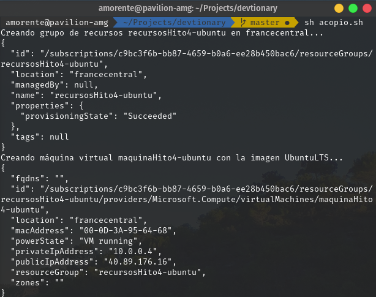

## Provisionamiento a cloud automático mediante CLI - Acopio

El código correspondiente al script que ejecuta los comandos planteados en [el documento de provisionamiento mediante CLI](./Repaso.md) está accesible en [esta ruta](https://github.com/adrianmorente/devtionary/acopio.sh), y su contenido es similar a lo siguiente:

```bash
#!/bin/bash

resourceGroup="RESOURCES"
location="LOCATION"
azureImage="IMAGE"
machineName="MACHINE"
adminUser="ADMIN"
size="SIZE"

# Creación del grupo de recursos en la ubicación elegida
echo "Creando grupo de recursos ${resourceGroup} en ${location}..."
az group create --name $resourceGroup --location $location

# Creación de la máquina virtual sobre los recursos creados
echo "Creando máquina virtual ${machineName} con la imagen ${azureImage}..."
az vm create -n $machineName \
  -g $resourceGroup \
  --image $azureImage \
  --admin-username $adminUser \
  --size $size \
  --generate-ssh-keys
```

Como es de esperar, en el primer bloque se asignan variables que contendrán el resultado de las elecciones tomadas en cuanto a sistemas operativos, tamaños de instancia, etc. A continuación, podemos observar cómo se crea el grupo de recursos, seguido de la creación de la máquina virtual que los utiliza, de forma similar a cómo lo venimos haciendo.

---

Modificando los valores de estas variables podemos crear diversas máquinas con imágenes, tamaños y ubicaciones físicas diferentes; lo que nos resulta muy útil para disponer de un conjunto y realizar medidas que justifiquen las decisiones finales. Este proceso de medición y justificación puede consultarse en [este documento](./Justificaciones.md).

Por ejemplo, su uso práctico en una ejecución real daría como resultado el siguiente:

<p align="center"></p>

El sistema operativo utilizado en la máquina creada en esta imagen será utilizada como candidata para la elección final, que consultaremos en [el documento previamente mencionado](./Justificaciones.md).
