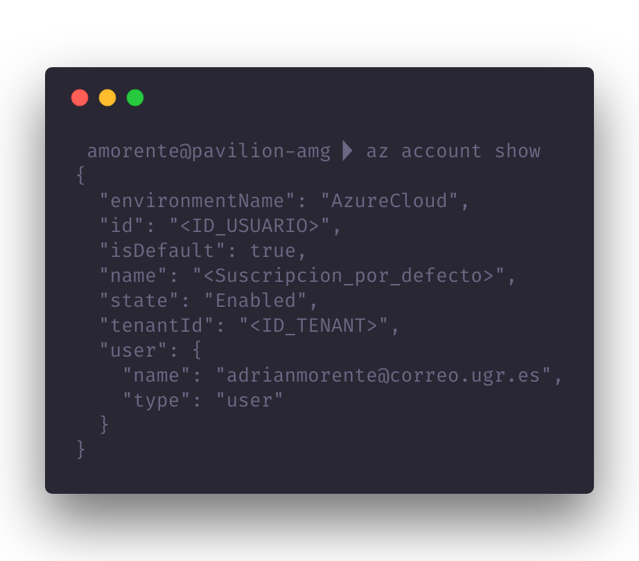
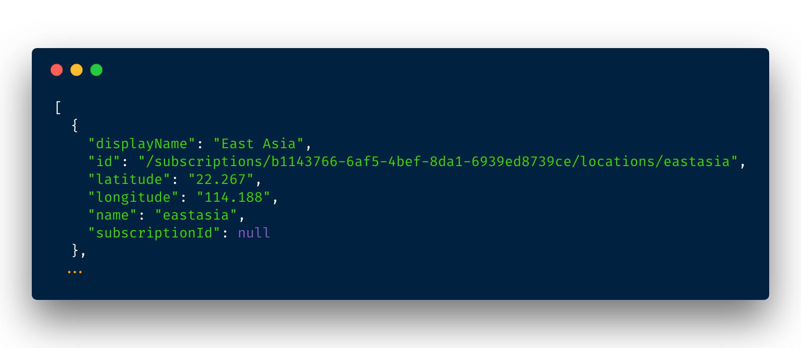

## Provisionamiento a cloud automático mediante CLI

Como decíamos en la descripción básica del proyecto, vamos a provisionar máquinas virtuales de nueva generación con el proyecto que estamos desarrollando, una vez más de forma automática mediante línea de comandos.

Cabe destacar que venimos utilizando ***Azure***, por tanto los pasos detallados van orientados al uso de este proveedor concretamente. De esta forma, en una sola terminal estaríamos realizando las acciones siguientes:

- Consulta de los sistemas operativos y ubicaciones para el centro de datos disponibles.
- Creación del grupo de recursos necesario, localizado en la ubicación elegida a partir de la lista consultada arriba.
- Creación de la máquina virtual con el sistema operativo elegido, alimentado por los recursos recién *generados*.

#### Consulta de las ubicaciones existentes de centros de datos

Como es lógico, sería insustancial explicar el proceso de instalación de la ya usada herramienta, por lo que pasaremos directamente al uso de comandos con los que consultar a la *API* de *Azure* sobre los diferentes recursos de que podemos disponer.

Si bien podemos usar el manual integrado en la terminal de la herramienta, nos será más cómodo buscar en la [documentación oficial](https://docs.microsoft.com/en-us/cli/azure/reference-index?view=azure-cli-latest) las opciones necesarias para sacarle el máximo partido.

###### Selección de suscripción en uso

Si gozamos de la posibilidad de disponer de diferentes suscripciones al proveedor (como es nuestro caso dado el acuerdo entre la Universidad y *Microsoft*), habremos de elegir la que queremos usar en cierto momento.

Con el comando `az account show` podemos ver las características de nuestro usuario así como la suscripción por defecto (tras el atributo `"name"`):

<p align="center"></p>

Podemos listar las disponibles [con la orden](https://docs.microsoft.com/en-us/cli/azure/account?view=azure-cli-latest#az-account-list) `az account list` y modificar dicha suscripción por defecto [con el comando](https://docs.microsoft.com/en-us/cli/azure/account?view=azure-cli-latest#az-account-set) `az account set -s "<nombre_suscripcion>"`, utilizando aquella donde dispongamos de saldo o que nos convenga particularmente.

###### Ubicaciones disponibles de recursos según suscripción

Una vez que tenemos clara y establecida la suscripción que utilizaremos, pasamos a decidir dónde se ubicarán los recursos virtuales que usemos. Esto vendrá limitado directamente por el proveedor en función de los patrocinios o contratos que tengamos acordados con él; como vemos en [este enlace](https://docs.microsoft.com/en-us/cli/azure/account?view=azure-cli-latest#az-account-list-locations), con la posibilidad de listar las opciones disponibles mediante el comando `az account list-locations`.

Una vez más en JSON se nos mostrará una salida (esta vez con mucho más contenido) detallando cada una de las ubicaciones de la siguiente forma:

<p align="center"></p>

Dado que tanto los sistemas operativos como los precios de los recursos serán iguales independientemente de la ubicación, escogeremos una de las más cercanas a nuestra ubicación actual, para paliar posibles latencias derivadas de la distancia física hasta el centro de datos. En este caso, los centros de datos más cercanos se encuentran ubicados en el sur y el centro de Francia (con nombre `francesouth` y `francecentral`, respectivamente).

#### Creación del grupo de recursos virtuales

Una vez que hemos elegido la ubicación donde alojar nuestros recursos virtuales, podremos proceder a la generación de éstos. Los argumentos mínimos necesarios serán el nombre que asignar al grupo de recursos y la ubicación del centro de datos elegido, en un comando de la siguiente forma:

`> az group create --name Recursos-Hito4 --location francecentral`

Según la observación realizada en el apartado anterior, deberíamos elegir el localizado en el sur de Francia; sin embargo, cuando probamos a generar un grupo de recursos en esta ubicación, el cliente de comandos nos informa de que no se encuentra disponible, así que optamos por la segunda opción (`francecentral`).

La ejecución del comando mencionado generará una salida similar a la siguiente, ofreciendo un mensaje *"Succeeded"* en el atributo `provisioningState` si efectivamente se han satisfecho los requisitos planteados por el usuario:

```json
{
  "id": "/subscriptions/ID_SUSCRIPCION/resourceGroups/Recursos-Hito4",
  "location": "francecentral",
  "managedBy": null,
  "name": "Recursos-Hito4",
  "properties": {
    "provisioningState": "Succeeded"
  },
  "tags": null
}

```

#### Consulta de los sistemas operativos disponibles

Las opciones detalladas de `az` pueden consultarse en [este enlace](https://docs.microsoft.com/en-us/cli/azure/image?view=azure-cli-latest). Las que nos interesan principalmente serán las que se corresponden con listar los sistemas operativos existentes y emplearlos para generar nuevas máquinas virtuales.

Como podemos observar en [dicha documentación](https://docs.microsoft.com/en-us/cli/azure/vm/image?view=azure-cli-latest), con el comando `az vm image list` podemos obtener (una vez más en formato JSON) una lista de los sistemas operativos disponibles en el *Marketplace* de *Azure* aptos para su instalación en una máquina virtual de nueva generación. Entre los resultados obtenidos figuran *caras conocidas* como lo son *Ubuntu Server, CentOS, CoreOS* y *openSUSE*, por ejemplo, así como diversas versiones de *Windows Server*, que obviaremos.

Para optar por una de estas alternativas habremos de realizar alguna medición empírica que justifique la elección más allá de los gustos o costumbres personales de uso. Además, debemos asegurarnos de que no existen diferencias presupuestarias entre los sistemas operativos (igual que SÍ existen en los diferentes tipos de máquinas virtuales, según su potencia o nivel de banda ancha). Veremos estas mediciones en el siguiente apartado.

#### Elección del sistema operativo para virtualización

Depende de las mediciones realizadas para compararlos

#### Creación de la máquina virtual que será provisionada

Una vez que hemos optado por un tamaño de máquina virtual y un sistema operativo, ejecutamos la generación de la máquina virtual con el siguiente comando, especificando además de estos parámetros el **nombre** que queremos asignarle, así como el **grupo de recursos** con el que abastecerla:

`az vm create -n ubuntuHito4 -g Recursos-Hito4 --image  --admin-username azure --generate-ssh-keys`

Por otro lado, al igual que se hizo con [la otra fase de provisionamiento](../Provisionamiento), podemos consultar la dirección IP de la nueva máquina con el comando `az vm list-ip-addresses`, que es la mostrada a continuación:

MV2: X.X.X.X
