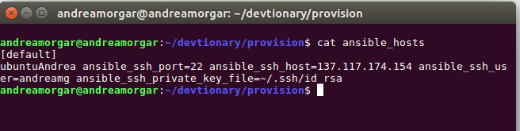
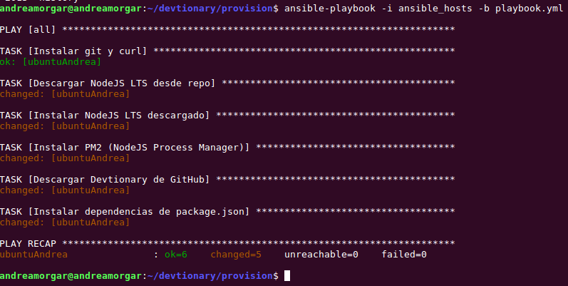
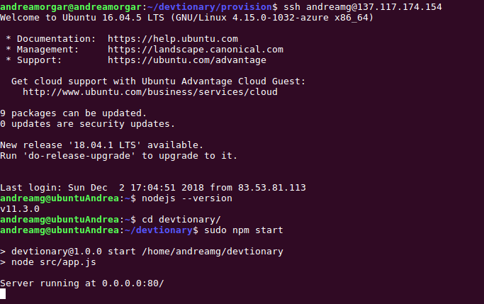

### Comprobación del provisionamiento en otra máquina

Realizado por @andreamorgar

Para poder comprobar en mi máquina virtual que el provisionamiento que ha realizado @adrianmorente para su trabajo funciona, lo primero que debemos hacer es acceder al fichero *ansible_hosts*, ya que hay que adaptarlo de forma que pueda ejecutarse para mi máquina virtual. En este fichero, tan solo tenemos que modificar dos cosas:
- **ansible_ssh_user** : al que le asigno el nombre del usuario de mi máquina.
- **ansible_ssh_host** : al que le asigno la IP de mi máquina.

Se puede ver a continuación como quedaría el fichero tras estas modificaciones.

Con este cambio, ya podríamos provisionar mi máquina virtual para que el proyecto pueda ejecutarse de forma correcta. Pero antes, vamos a comprobar que alguno de los paquetes que necesita el proyecto de Adrián no están instalados en mi máquina (y así asegurarnos de que efectivamente funciona su provisión). Este es el caso, por ejemplo, de *Node.js*, como podemos ver en la siguiente imagen.

A continuación, realizamos el provisionamiento, tal y como puede verse en la siguiente imagen.

Si nos fijamos en la imagen anterior, el provisionamiento se ha realizado de manera correcta. De hecho, podemos volver a intentar comprobar que está instalado *Node.js*, como se muestra a continuación. Podemos ver, que efectivamente ahora sí está instalado en el sistema y que podemos iniciar el servicio.

Por último, vamos a ejecutar el servicio, el cuál funciona correctamente, tal y como se puede apreciar en la siguiente imagen.

